## **Question is asking to consider that model is converged when $|\theta_t - \theta^*| < \varepsilon$.**

## **Q. Determine the average number of steps required to satisfy this convergence criterion**

### Dataset 1

**True Minimizer ($\theta^*$): [ 0.9507064,  99.98412345]**

**After 15 epochs**
- Full-Batch GD $\theta$:     [-1.03535825, 99.95728881]
- Stochastic GD $\theta$:     [1.02389021, 100.11134385]
- Momentum GD $\theta$:     [-1.0396, 78.2427]

Full-batch GD converged in 790.15 ± 45.97 epochs on average.
Stochastic GD converged in 115470.30 ± 87039.58 epochs on average.

Full-batch GD(Momentum) converged in 7858.0 ± 0.0 epochs on average
Stochastic GD(Momentum) converged in 6353.9 ± 1082.7 updates on average

  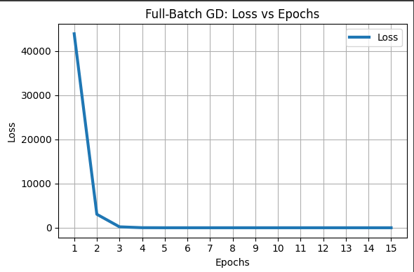
  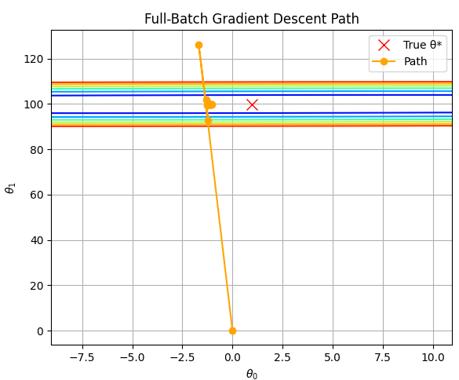

  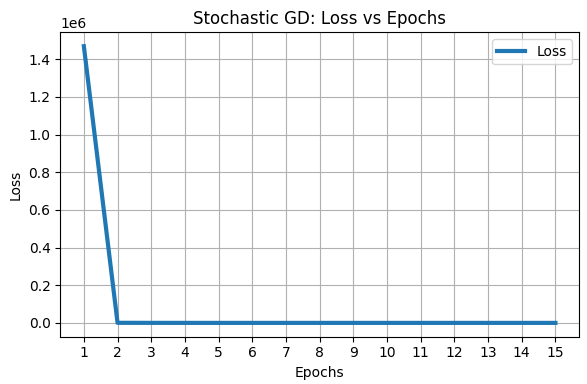
  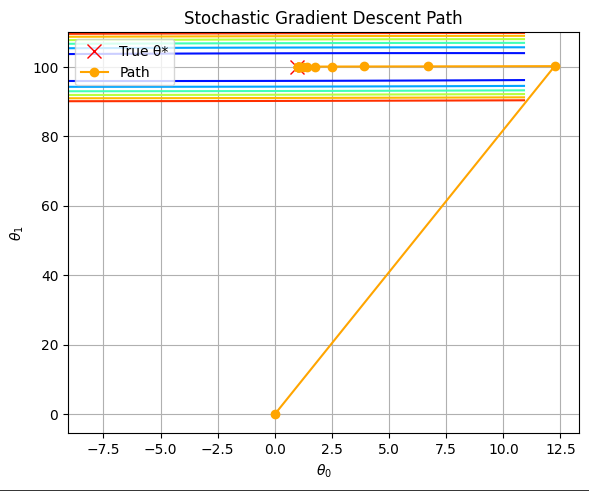

  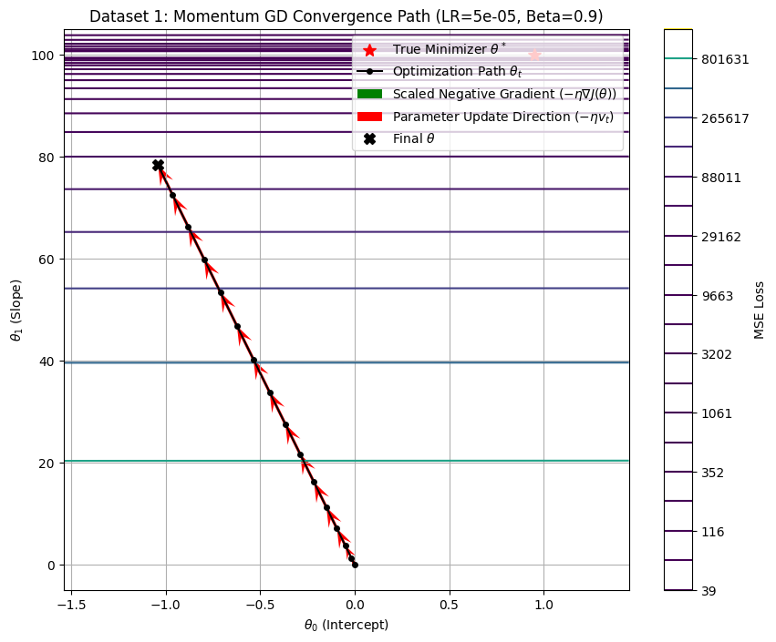
  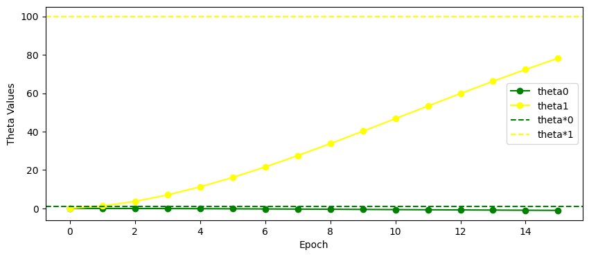

### Dataset 2 

**True Minimizer ($\theta^*$): [3.9507064,  2.68246893]**

**After 15 epochs**
- Full-Batch GD $\theta$:     [0.52151853, 0.07835048]
- Stochastic GD $\theta$:     [3.89457787, 2.19803786]
- Momentum GD $\theta$:     [4.0236, 0.8647]

Full-batch GD converged in 2603.50 ± 114.20 epochs on average.
Stochastic GD converged in 92.00 ± 36.68 epochs on average.

Full-batch GD(Momentum) converged in 26289.0 ± 0.0 epochs on average
Stochastic GD(Momentum) converged in 23302.0 ± 528.8 updates on average

  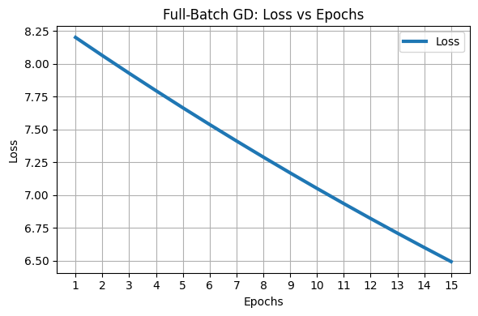
  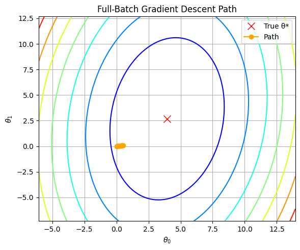

  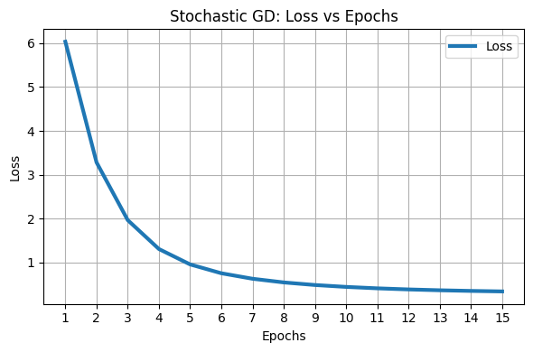
  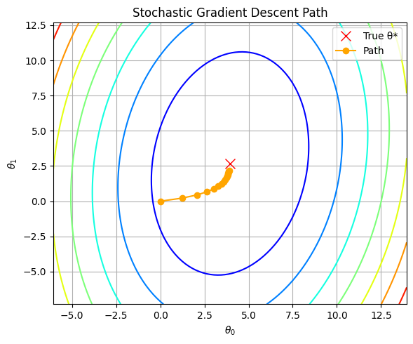

  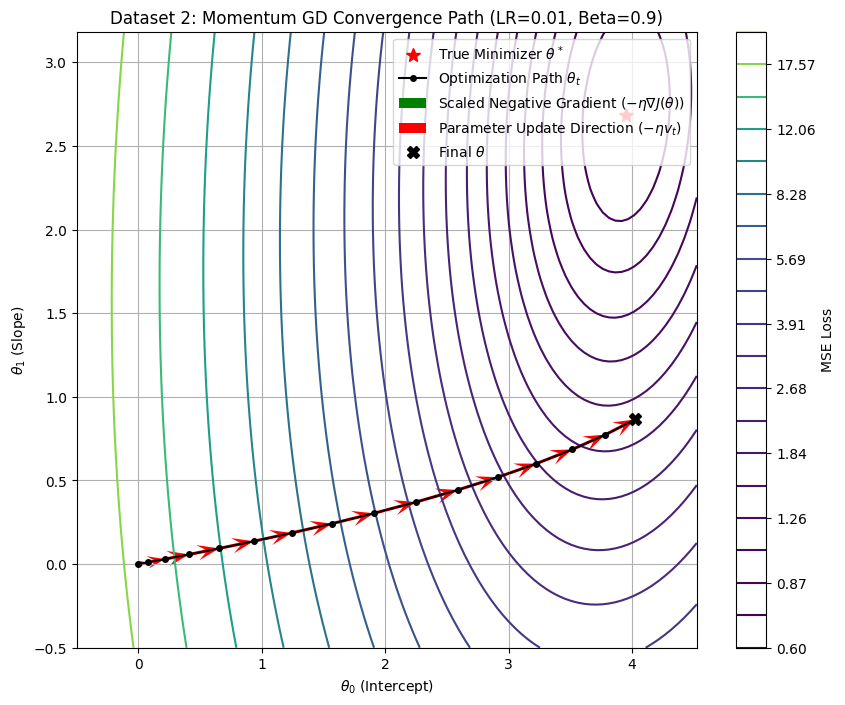
  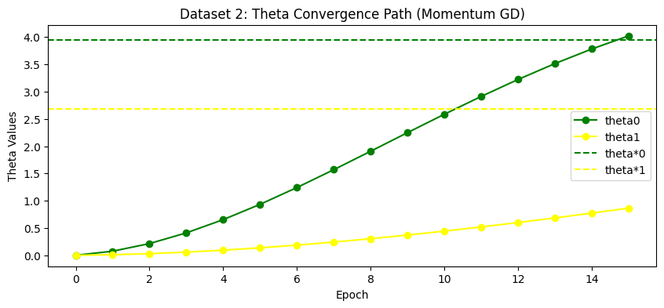

