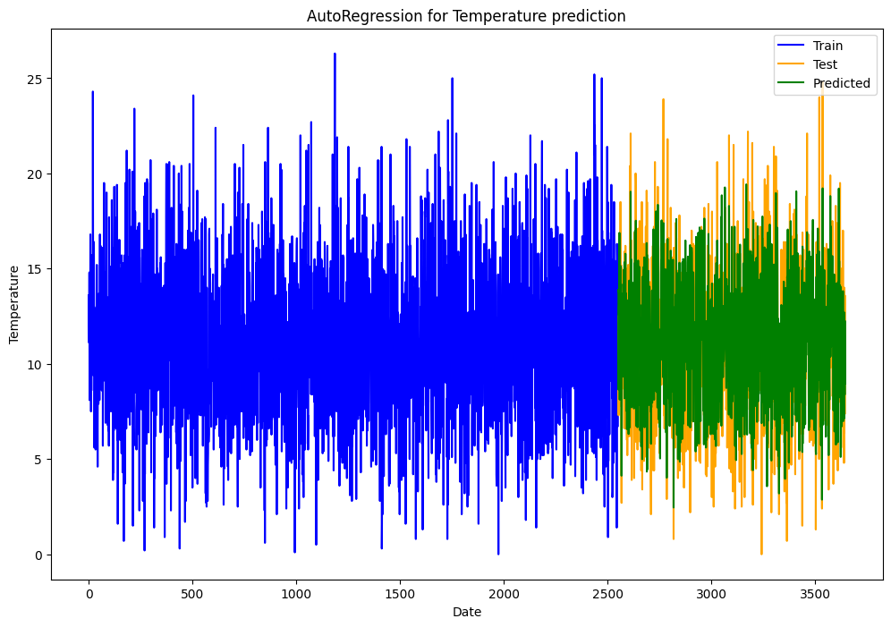

```python
import pandas as pd
from sklearn.model_selection import train_test_split
from sklearn.linear_model import LinearRegression
from sklearn.metrics import root_mean_squared_error
import matplotlib.pyplot as plt
```

```python
# loading the data from dataset
data_file_url = "https://raw.githubusercontent.com/jbrownlee/Datasets/master/daily-min-temperatures.csv"
data = pd.read_csv(data_file_url)
```

```python
df = pd.DataFrame()
# df['Four_D_B_Yes'] = data['Temp'].shift(6) --- including this is giving more RMSE 
df['Three_D_B_Yes'] = data['Temp'].shift(5)
df['Two_D_B_Yes'] = data['Temp'].shift(4)
df['D_B_Yes'] = data['Temp'].shift(3)
df['Yesterday'] = data['Temp'].shift(2)
df['Today'] = data['Temp'].shift(1)
df['Tomorrow'] = data['Temp']
df = df.dropna()
print(df.head())
```

```
   Three_D_B_Yes  Two_D_B_Yes  D_B_Yes  Yesterday  Today  Tomorrow
5           20.7         17.9     18.8       14.6   15.8      15.8
6           17.9         18.8     14.6       15.8   15.8      15.8
7           18.8         14.6     15.8       15.8   15.8      17.4
8           14.6         15.8     15.8       15.8   17.4      21.8
9           15.8         15.8     15.8       17.4   21.8      20.0
```

```python
X = df[['Three_D_B_Yes','Two_D_B_Yes','D_B_Yes','Yesterday','Today']]
y = df['Tomorrow']

X_train, X_test, y_train, y_test = train_test_split(X, y, test_size = 0.3, random_state = 42)

print(len(X_train))
print(len(X_test))
print(len(y_train))
print(len(y_test))
```

```
2551
1094
2551
1094
```

```python
model = LinearRegression()
model.fit(X_train, y_train)

print("Model trained successfully!")
print("Intercept :: ", model.intercept_)
print("Coefficient (Today) :: ", model.coef_[0])
print("Coefficient (Yesterday) :: " , model.coef_[1])
print("Coefficient (D_B_Yes) :: ", model.coef_[2])
print("Coefficient (Two_D_B_Yes) :: ", model.coef_[3])
print("Coefficient (Three_D_B_Yes) :: ", model.coef_[4])
```

```
Model trained successfully!
Intercept ::  1.465936726233961
Coefficient (Today) ::  0.13107427133613397
Coefficient (Yesterday) ::  0.06365336278540046
Coefficient (D_B_Yes) ::  0.08164509001105007
Coefficient (Two_D_B_Yes) ::  -0.06756079662411978
Coefficient (Three_D_B_Yes) ::  0.6578319575178396
```

```python
predictions = model.predict(X_test)
rmse = root_mean_squared_error(y_test, predictions)
print("The Root Mean Squared Error(RMSE) of model is :: ", rmse)
```

```
The Root Mean Squared Error(RMSE) of model is ::  2.3410902680961567
```

```python
test_indices = np.arange(len(y_train), len(y_train) + len(y_test))

plt.figure(figsize=(12, 8))
plt.plot(y_train.values, label = 'Train', color = 'blue')
plt.plot(test_indices, y_test.values, label = 'Test', color = 'orange')
plt.plot(test_indices, predictions, label = 'Predicted', color = 'green')
plt.title('AutoRegression for Temperature prediction')
plt.xlabel('Date')
plt.ylabel('Temperature')
plt.legend()
plt.show()
```

<br>

<p align="center">
  
</p>


